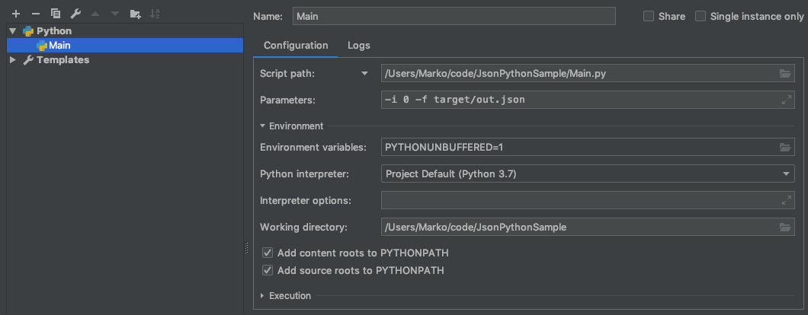

# JsonPythonSample
Deserialize/Serialize JSON examples using Python3

Rudimentary implementation of Serializing/Deserializing JSON to a sample Python object and vice versa. The current implementation only allows writing/reading to a file.

# Getting Started

The program requires 2 parameters: 

`1: -i {binary value: use 0 to write JSON model to file or 1 to read the json to the Python class}`

`2: -f target/out.json NOTE** if the target directory does not exist, the application will make it for you`

# Sample Configuration (PyCharm)

# Running via CLI example

`python3 Main.py -i 0 -f target/out.json`
